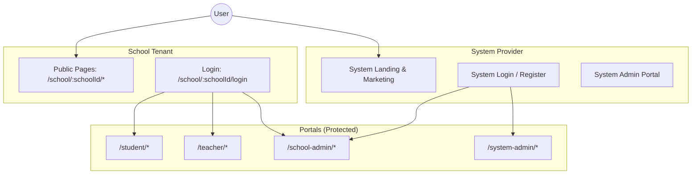
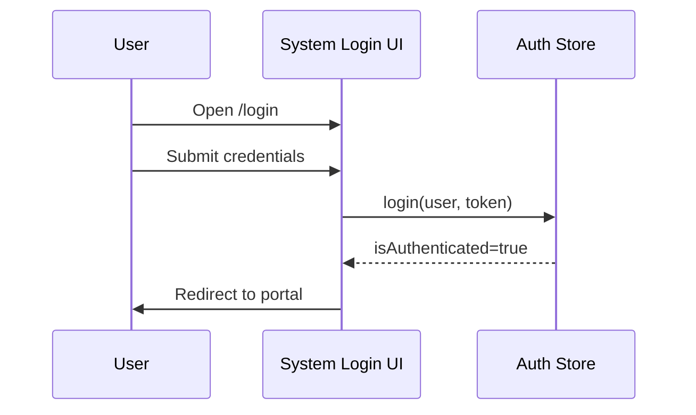
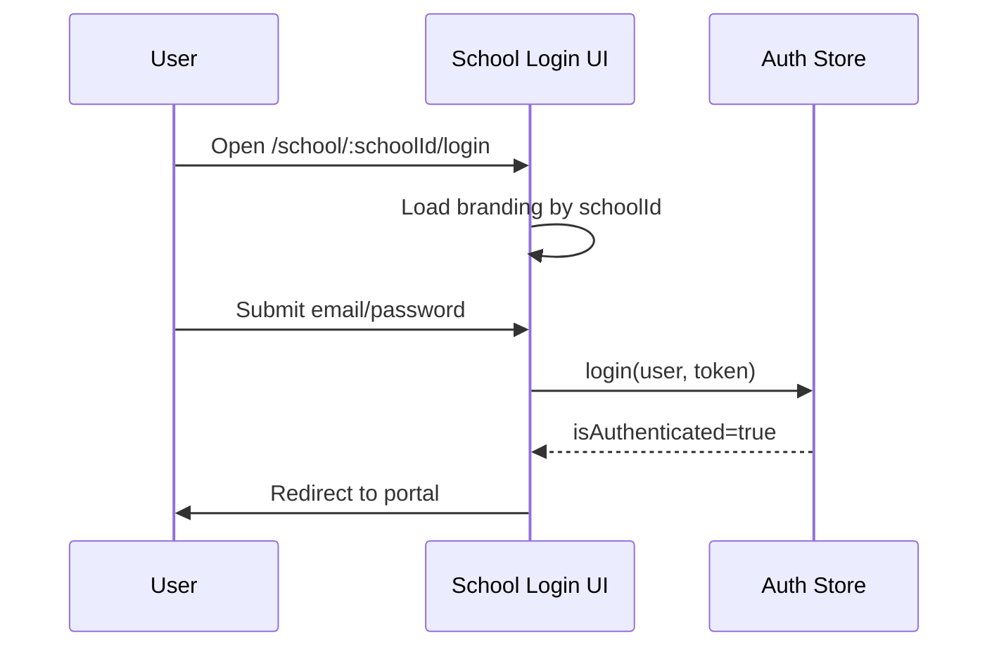
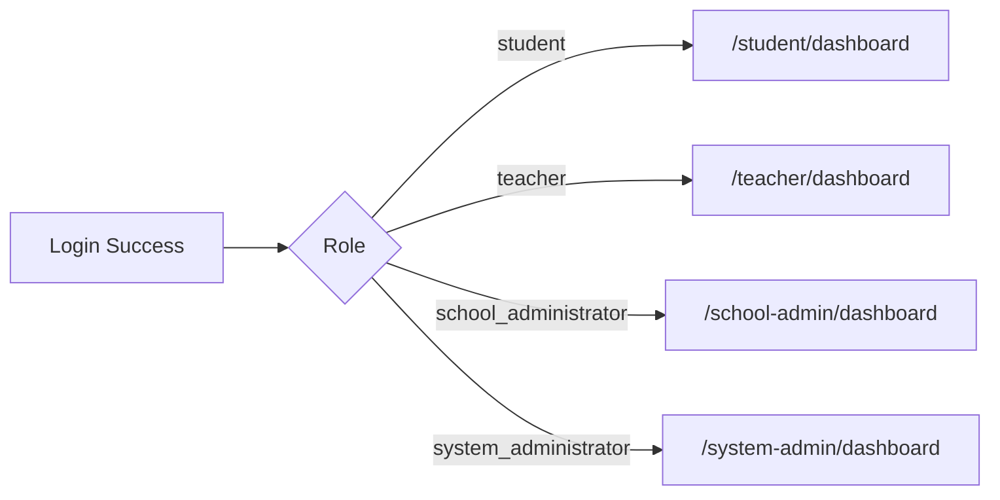
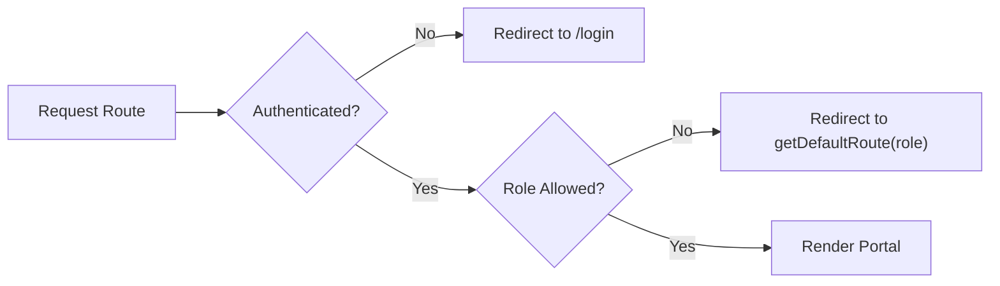
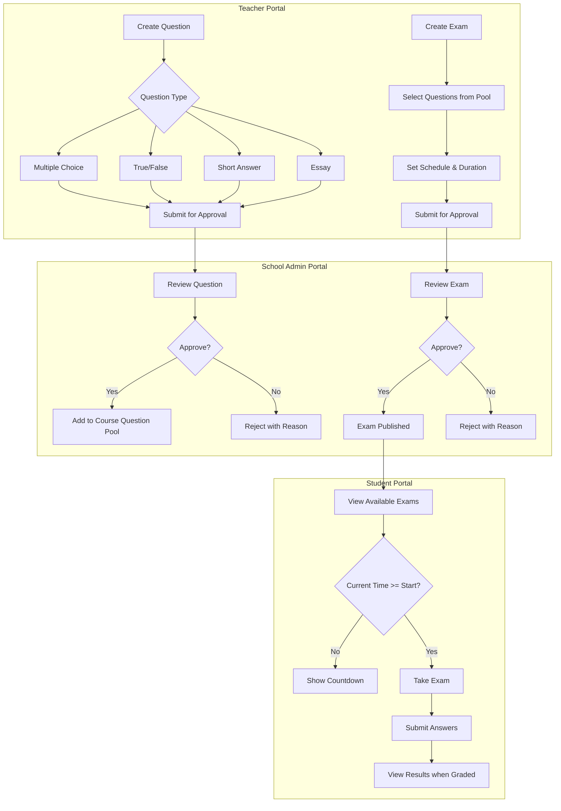

# Workflow & Routing Architecture

Multi-tenant routing, portal flows, login workflows, and exam approval processes.

---

## Multi-Tenant Architecture

### System Overview



### Tenant Context

- **System Provider**: Platform owner manages global pages and school onboarding
- **School Tenant**: Each school has branded public pages under `/school/:schoolId`
- **Portals**: Role-specific protected routes (not tenant-prefixed in current implementation)

---

## Route Structure

### System Provider Routes (Public)

| Path | Component | Description |
|------|-----------|-------------|
| `/` | SystemHome | Platform landing page |
| `/about` | SystemAbout | About page |
| `/contact` | SystemContact | Contact form |
| `/pricing` | SystemPricing | Pricing plans |
| `/login` | SystemLogin | System login |
| `/register` | SystemRegister | School registration |
| `/forgot-password` | SystemForgotPassword | Password reset |
| `/docs` | SystemDocs | Documentation |
| `/help` | SystemHelp | Help center |
| `/status` | SystemStatus | System status |
| `/terms` | SystemTerms | Terms of service |
| `/privacy` | SystemPrivacy | Privacy policy |
| `/cookies` | SystemCookies | Cookie policy |
| `/gdpr` | SystemGDPR | GDPR compliance |

### School Public Routes

| Path | Component | Description |
|------|-----------|-------------|
| `/school/:schoolId` | SchoolHome | School landing page |
| `/school/:schoolId/about` | SchoolAbout | School about page |
| `/school/:schoolId/contact` | SchoolContact | School contact |
| `/school/:schoolId/pricing` | SchoolPricing | School pricing |
| `/school/:schoolId/rules` | SchoolRules | School rules |
| `/school/:schoolId/login` | SchoolLogin | School-branded login |

### Student Portal (`/student/*`)

**Allowed Roles**: `student`

| Path | Component | Description |
|------|-----------|-------------|
| `/student/dashboard` | StudentDashboard | Student overview |
| `/student/qr-id` | StudentQRId | Virtual ID card |
| `/student/grades` | StudentGrades | Grade viewing |
| `/student/schedule` | StudentSchedule | Class schedule |
| `/student/courses` | StudentCourses | Enrolled courses |
| `/student/advisor` | StudentAdvisor | Academic advisor |
| `/student/assignments` | StudentAssignments | Assignments |
| `/student/fees` | StudentFees | Fee payments |
| `/student/calendar` | StudentCalendar | Academic calendar |
| `/student/exams` | StudentExams | Exam schedule |
| `/student/profile` | StudentProfile | Profile settings |

### Teacher Portal (`/teacher/*`)

**Allowed Roles**: `teacher`

| Path | Component | Description |
|------|-----------|-------------|
| `/teacher/dashboard` | TeacherDashboard | Teacher overview |
| `/teacher/courses` | TeacherCourses | Assigned courses |
| `/teacher/students` | TeacherStudents | Student roster |
| `/teacher/exams` | TeacherExams | Exam management |
| `/teacher/announcements` | TeacherAnnouncements | Announcements |

### School Admin Portal (`/school-admin/*`)

**Allowed Roles**: `school_administrator`, `manager`, `finance_officer`, `help_desk`

| Path | Component | Description |
|------|-----------|-------------|
| `/school-admin/dashboard` | AdminDashboard | Admin overview |
| `/school-admin/students` | StudentList | Student management |
| `/school-admin/students/new` | StudentCreate | Add student |
| `/school-admin/students/:id` | StudentDetail | Student details |
| `/school-admin/students/:id/edit` | StudentEdit | Edit student |
| `/school-admin/teachers` | TeacherList | Teacher management |
| `/school-admin/teachers/new` | TeacherCreate | Add teacher |
| `/school-admin/teachers/:id` | TeacherDetail | Teacher details |
| `/school-admin/courses` | AdminCourses | Course management |
| `/school-admin/announcements` | AdminAnnouncement | Announcements |
| `/school-admin/exams` | AdminExams | Exam management |
| `/school-admin/finance` | AdminFinance | Financial overview |
| `/school-admin/invoices` | AdminInvoices | Invoice management |
| `/school-admin/reports` | AdminReports | Reporting |
| `/school-admin/settings` | AdminSettings | School settings |

### System Admin Portal (`/system-admin/*`)

**Allowed Roles**: `system_administrator`

| Path | Component | Description |
|------|-----------|-------------|
| `/system-admin/dashboard` | SystemDashboard | Platform overview |
| `/system-admin/schools` | SchoolsPage | School management |
| `/system-admin/school-admins` | SchoolAdminsPage | Admin management |
| `/system-admin/users` | SystemUsersPage | User management |
| `/system-admin/roles` | RolesPermissionsPage | Role management |
| `/system-admin/announcements` | SystemAnnouncementsPage | Announcements |
| `/system-admin/reports` | SystemReportsPage | Reporting |
| `/system-admin/integrations` | IntegrationsPage | Third-party integrations |
| `/system-admin/audit-logs` | AuditLogsPage | Audit logs |
| `/system-admin/settings` | SystemSettingsPage | System settings |
| `/system-admin/support` | SupportCenterPage | Support center |
| `/system-admin/security` | SecurityPage | Security settings |
| `/system-admin/health` | SystemHealthPage | System health |

---

## Login Flows

### System Login (Platform Level)

Entry: `GET /login`



### School Login (Tenant Level)

Entry: `GET /school/:schoolId/login`



### Mock Authentication (Demo)

Email keywords determine role assignment:
- Contains `student` → student role
- Contains `teacher` → teacher role
- Contains `admin` → school_administrator role
- Contains `system` → system_administrator role

---

## Portal Flow



---

## Route Protection

### ProtectedRoute Component

```tsx
<ProtectedRoute allowedRoles={['school_administrator', 'manager']}>
  <AdminLayout />
</ProtectedRoute>
```

### Protection Flow



---

## Exam/Quiz Approval Workflow

### Workflow Overview



### Question Types

| Type | Code | Auto-Grading |
|------|------|--------------|
| Multiple Choice | `multiple_choice` | Yes |
| True/False | `true_false` | Yes |
| Short Answer | `short_answer` | No |
| Essay | `essay` | No |

### Approval States

**Questions:**
```
[*] → pending → approved → [Question Pool]
              → rejected → (revise) → pending
```

**Exams:**
```
[*] → draft → pending_approval → approved → [Published]
                               → rejected → draft
```

### Time-Based Exam Visibility

Students can only see and take exams when:
1. Exam status is `approved`
2. Current time is >= `availableAt`
3. Current time is <= `endsAt`

---

## Session Management

### Authentication Store

```typescript
interface AuthState {
  user: User | null;
  token: string | null;
  isAuthenticated: boolean;
}
```

- Stored in localStorage under `auth-storage`
- Persists across page refreshes
- Cleared on logout

---

## Internationalization

### Supported Languages

| Language | Code | RTL |
|----------|------|-----|
| English | `en` | No |
| Burmese | `my` | Yes |

### Translation Files

- `src/i18n/locales/en.json`
- `src/i18n/locales/my.json`

---

## See Also

- [Frontend Architecture](./frontend.md) - Technical architecture
- [API Integration](./api-integration.md) - Backend patterns
- [Roles & Permissions](../03-auth-rbac/roles-permissions.md) - RBAC details
