# School Management System - Workflow & Architecture

This document details the multi-tenant architecture, role-based access control, login flows, data management, and end-to-end portal navigation.

## 1. High-Level Architecture

The application is a single multi-tenant frontend serving multiple schools.

- **System Provider (Platform Owner)**: Onboards schools and manages global pages.
- **Tenants (Schools)**: Each school has public pages and branded login under `school/:schoolId`.
- **Portals**: Role-specific portals are protected routes.

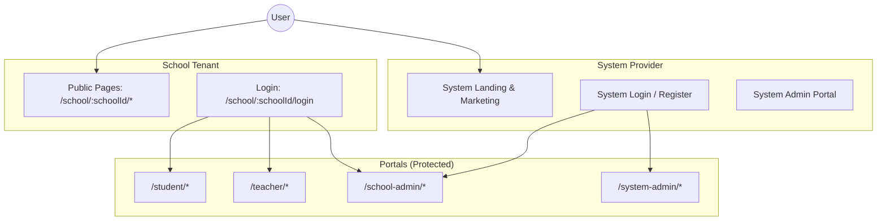

## 2. Roles & Access Control

RBAC is enforced client-side by a route guard.

### Roles
| Role | Code | Portal Access |
|------|------|---------------|
| System Administrator | `system_administrator` | `/system-admin/*` |
| School Administrator | `school_administrator` | `/school-admin/*` |
| Manager | `manager` | `/school-admin/*` |
| Finance Officer | `finance_officer` | `/school-admin/*` |
| Help Desk | `help_desk` | `/school-admin/*` |
| Teacher | `teacher` | `/teacher/*` |
| Student | `student` | `/student/*` |

### Route Guard
- **Guard Component**: `ProtectedRoute` checks auth and allowed roles
- **Default Route**: `getDefaultRoute(role)` returns portal home
- **Permissions**: `ROUTE_PERMISSIONS` defines allowed roles per path

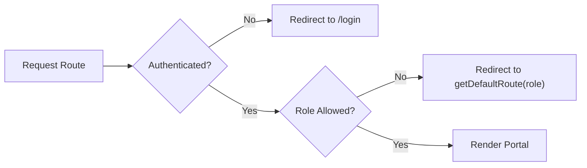

## 3. Route Structure

### System Provider Routes (Public)

| Path | Component | Description |
|------|-----------|-------------|
| `/` | SystemHome | Platform landing page |
| `/about` | SystemAbout | About page |
| `/contact` | SystemContact | Contact form |
| `/pricing` | SystemPricing | Pricing plans |
| `/terms` | SystemTerms | Terms of service |
| `/privacy` | SystemPrivacy | Privacy policy |
| `/login` | SystemLogin | System login |
| `/register` | SystemRegister | School registration |
| `/forgot-password` | SystemForgotPassword | Password reset |
| `/docs` | SystemDocs | Documentation |
| `/community` | SystemCommunity | Community page |
| `/status` | SystemStatus | System status |
| `/help` | SystemHelp | Help center |
| `/careers` | SystemCareers | Careers listing |
| `/careers/:slug` | SystemCareerDetail | Career detail |
| `/press` | SystemPress | Press releases |
| `/press/:slug` | SystemPressDetail | Press detail |
| `/cookies` | SystemCookies | Cookie policy |
| `/gdpr` | SystemGDPR | GDPR compliance |

### School Public Routes

| Path | Component | Description |
|------|-----------|-------------|
| `/school/:schoolId` | SchoolHome | School landing page |
| `/school/:schoolId/about` | SchoolAbout | School about page |
| `/school/:schoolId/contact` | SchoolContact | School contact |
| `/school/:schoolId/pricing` | SchoolPricing | School pricing |
| `/school/:schoolId/rules` | SchoolRules | School rules |
| `/school/:schoolId/login` | SchoolLogin | School-branded login |

### Student Portal Routes (`/student/*`)

**Allowed Roles**: `student`

| Path | Component | Description |
|------|-----------|-------------|
| `/student/dashboard` | StudentDashboard | Student overview |
| `/student/qr-id` | StudentQRId | Virtual ID card |
| `/student/grades` | StudentGrades | Grade viewing |
| `/student/schedule` | StudentSchedule | Class schedule |
| `/student/courses` | StudentCourses | Enrolled courses |
| `/student/advisor` | StudentAdvisor | Academic advisor |
| `/student/assignments` | StudentAssignments | Assignments |
| `/student/fees` | StudentFees | Fee payments |
| `/student/calendar` | StudentCalendar | Academic calendar |
| `/student/exams` | StudentExams | Exam schedule |
| `/student/profile` | StudentProfile | Profile settings |

### Teacher Portal Routes (`/teacher/*`)

**Allowed Roles**: `teacher`

| Path | Component | Description |
|------|-----------|-------------|
| `/teacher/dashboard` | TeacherDashboard | Teacher overview |
| `/teacher/courses` | TeacherCourses | Assigned courses |
| `/teacher/students` | TeacherStudents | Student roster |
| `/teacher/exams` | TeacherExams | Exam management |
| `/teacher/announcements` | TeacherAnnouncements | Announcements |

### School Admin Portal Routes (`/school-admin/*`)

**Allowed Roles**: `school_administrator`, `manager`, `finance_officer`, `help_desk`

| Path | Component | Description |
|------|-----------|-------------|
| `/school-admin/dashboard` | AdminDashboard | Admin overview |
| `/school-admin/students` | StudentList | Student list |
| `/school-admin/students/new` | StudentCreate | Add student |
| `/school-admin/students/:id` | StudentDetail | Student details |
| `/school-admin/students/:id/edit` | StudentEdit | Edit student |
| `/school-admin/teachers` | TeacherList | Teacher list |
| `/school-admin/teachers/new` | TeacherCreate | Add teacher |
| `/school-admin/teachers/:id` | TeacherDetail | Teacher details |
| `/school-admin/teachers/:id/edit` | TeacherEdit | Edit teacher |
| `/school-admin/courses` | AdminCourses | Course management |
| `/school-admin/announcements` | AdminAnnouncement | Announcements |
| `/school-admin/exams` | AdminExams | Exam management |
| `/school-admin/finance` | AdminFinance | Financial overview |
| `/school-admin/invoices` | AdminInvoices | Invoice management |
| `/school-admin/reports` | AdminReports | Reporting |
| `/school-admin/settings` | AdminSettings | System settings |

### System Admin Portal Routes (`/system-admin/*`)

**Allowed Roles**: `system_administrator`

| Path | Component | Description |
|------|-----------|-------------|
| `/system-admin/dashboard` | SystemDashboard | Platform overview |
| `/system-admin/users` | AdminUsers | User management |
| `/system-admin/users/new` | UserCreate | Add user |
| `/system-admin/users/:id` | UserDetail | User details |
| `/system-admin/users/:id/edit` | UserEdit | Edit user |
| `/system-admin/courses` | AdminCourses | Course management |
| `/system-admin/finance` | AdminFinance | Financial overview |
| `/system-admin/reports` | AdminReports | Reporting |
| `/system-admin/settings` | AdminSettings | System settings |

## 4. Login Flows

### A. System Login (Platform Level)

- **Entry**: `GET /login`
- **Purpose**: Platform owner or cross-tenant login
- **Flow**: Demo-only; sets role based on email keywords

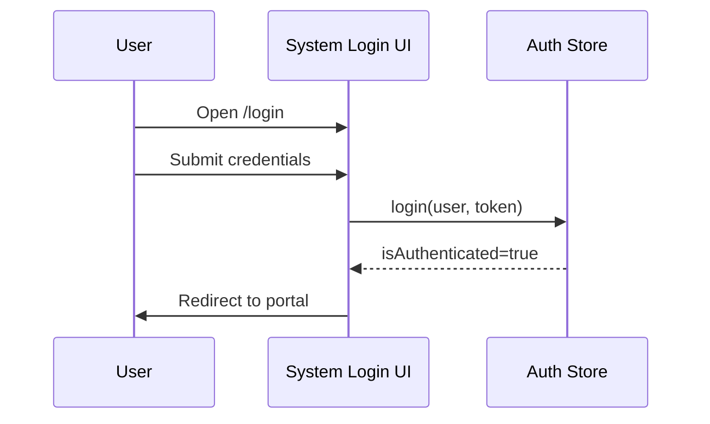

### B. School Login (Tenant Level)

- **Entry**: `GET /school/:schoolId/login`
- **Purpose**: Students, teachers, and school admins
- **Flow**: Load school branding, authenticate, redirect to portal

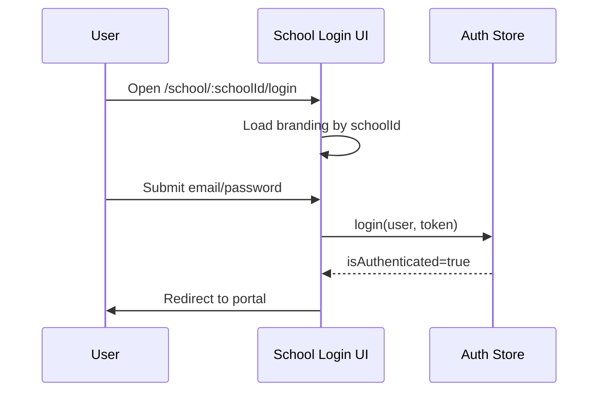

### C. Mock Authentication (Demo)

The current implementation uses mock authentication:
- Email keywords determine role assignment
- Contains `student` → student role
- Contains `teacher` → teacher role
- Contains `admin` → school_administrator role
- Contains `system` → system_administrator role

## 5. Navigation Configuration

Navigation items are defined in `src/config/navigation.tsx`:

### Admin Navigation (`adminNavItems`)
For school_administrator, manager, finance_officer, help_desk:
- Dashboard, Students, Teachers, Courses
- Announcements, Exams/Quizzes, Finance
- Invoices, Reports, Settings

### Director Navigation (`directorNavItems`)
For system_administrator:
- Dashboard, Users, Courses
- Finance, Reports, Settings

### Student Navigation (`studentNavItems`)
- Dashboard, QR Virtual ID, Grades
- Schedule, Courses, Advisor
- Assignments, Payments, Calendar, Profile

### Teacher Navigation (`teacherNavItems`)
- Dashboard, My Courses, Students
- Exams, Announcements, Profile

## 6. Portal Flow

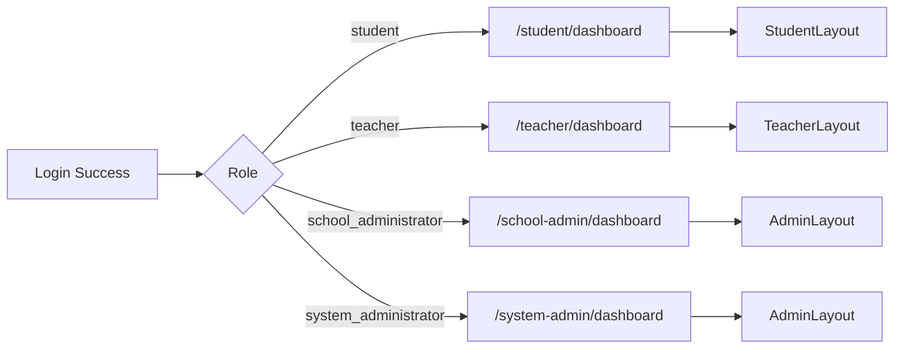

## 7. Layout Architecture

All protected portals use the unified `ProtectedLayout` component:

```tsx
// ProtectedLayout handles:
// - Sidebar with navigation
// - User/Student info card
// - Main content area with Container
// - Logout functionality
```

### Layout Hierarchy
```
ProtectedLayout
├── Sidebar
│   ├── Brand Logo
│   ├── User/Student Info Card
│   ├── Primary Navigation
│   ├── Secondary Navigation
│   └── Sign Out Button
└── Main Content
    └── Container
        └── Page Component (via Outlet)
```

### Portal-Specific Layouts
| Layout | Portal | Nav Items | User Card |
|--------|--------|-----------|-----------|
| AdminLayout | school-admin, system-admin | Role-based (admin/director) | User info |
| StudentLayout | student | studentNavItems | Student info card |
| TeacherLayout | teacher | teacherNavItems | User info |

## 8. Security & Session Management

### Authentication Store (Zustand)
```typescript
// Stored in localStorage under 'auth-storage'
interface AuthState {
  user: User | null;
  token: string | null;
  isAuthenticated: boolean;
}
```

### Route Protection Flow
1. `ProtectedRoute` checks `isAuthenticated` from store
2. If not authenticated → redirect to `/login`
3. If authenticated, checks if user role is in `allowedRoles`
4. If role not allowed → redirect to `getDefaultRoute(role)`
5. If authorized → render children

### Session Persistence
- Auth state persisted to localStorage
- Survives page refresh
- Cleared on logout

## 9. Data Management

### Current Implementation (Mock Data)
- Student data: `loadStudents()`, `saveStudents()` (localStorage)
- Teacher data: `loadTeachers()`, `saveTeachers()` (localStorage)
- User data: In-memory mock data

### Data Flow
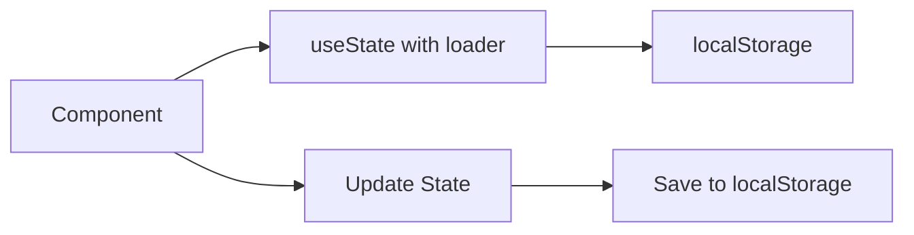

### Entity Relationships (Conceptual)
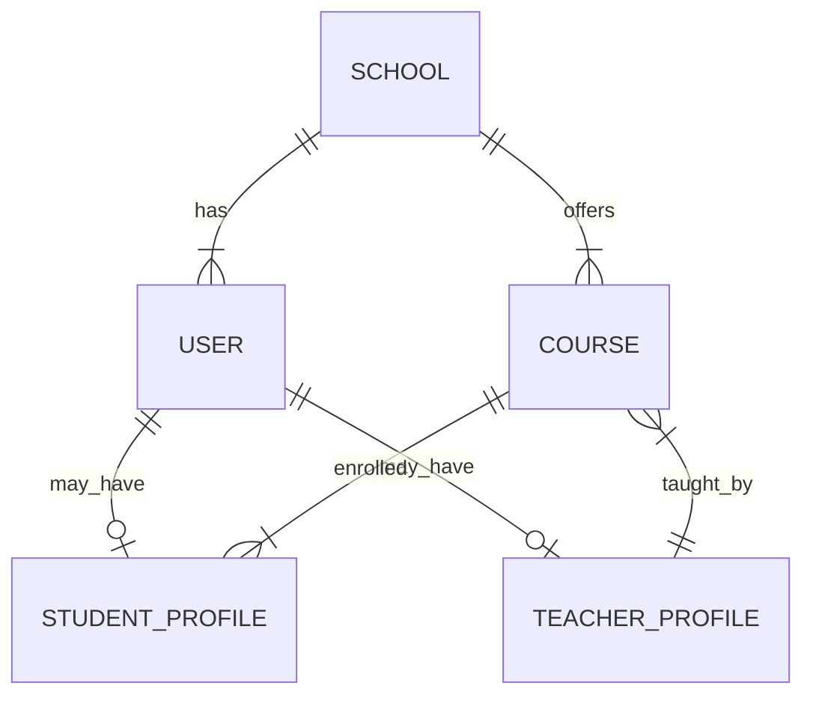

## 10. Multi-Tenancy Notes

### Current Implementation
- Public school context via `:schoolId` in URLs
- Portals are global (not prefixed by schoolId)
- Mock data is shared across all schools

### Future Enhancement Path
If tenant-scoped portals are needed:
1. Update routes to include schoolId: `/:schoolId/admin/*`
2. Add school context to layouts
3. Filter data by school in API calls
4. Store schoolId in auth state

## 11. Internationalization (i18n)

### Supported Languages
- English (en) - Primary
- Burmese (my) - Secondary

### RTL Support
```tsx
<div dir={i18n.language === 'my' ? 'rtl' : 'ltr'}>
  {/* App content */}
</div>
```

### Translation Files
- `src/i18n/locales/en.json`
- `src/i18n/locales/my.json`

## 12. Error Handling

### Unauthorized Access
- Unauthenticated → redirect to `/login`
- Wrong role → redirect to user's default portal

### Invalid Routes
- Catch-all route redirects to `/`

### Invalid School ID
- School public pages should show error if schoolId is invalid

## 13. Notifications

Using Sonner for toast notifications:
```tsx
<Toaster
  position="top-right"
  expand={true}
  richColors
  closeButton
/>
```

## 14. Exam/Quiz Approval Workflow

The system implements a comprehensive exam management workflow with approval gates between Teachers, School Administrators, and Students.

### Workflow Overview

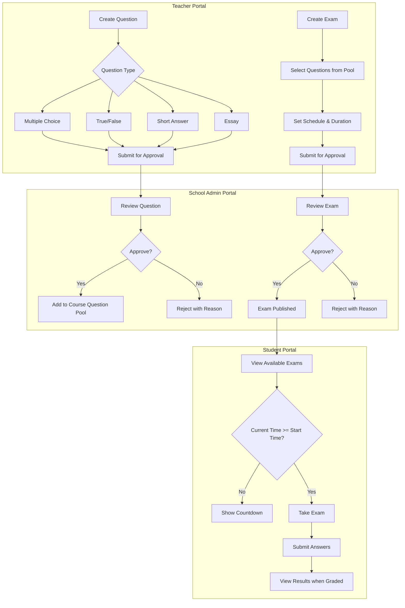

### Question Types

| Type | Code | Description | Auto-Grading |
|------|------|-------------|--------------|
| Multiple Choice | `multiple_choice` | Single correct answer from options | Yes |
| True/False | `true_false` | Boolean answer | Yes |
| Short Answer | `short_answer` | Brief text response | No |
| Essay | `essay` | Long-form written response | No |

### Question Approval States

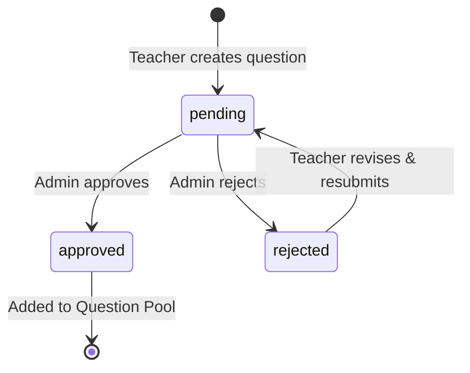

| State | Description | Actions Available |
|-------|-------------|-------------------|
| `pending` | Awaiting admin review | Admin: Approve/Reject |
| `approved` | Added to course question pool | Teacher: Use in exams |
| `rejected` | Not approved, needs revision | Teacher: Edit & resubmit |

### Exam Approval States

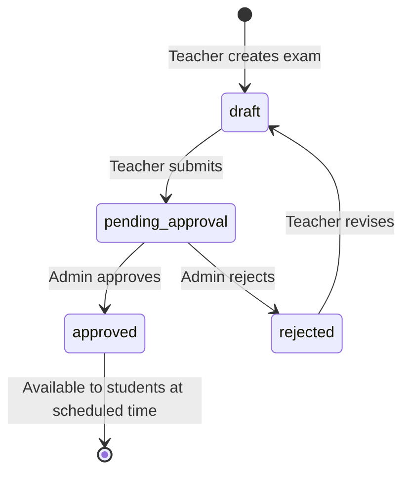

| State | Description | Actions Available |
|-------|-------------|-------------------|
| `draft` | Work in progress | Teacher: Edit, Submit |
| `pending_approval` | Awaiting admin review | Admin: Approve/Reject |
| `approved` | Published, visible to students | Students: Take at scheduled time |
| `rejected` | Not approved | Teacher: Edit & resubmit |

### Course-Specific Question Pools

Each course/subject maintains its own question pool:

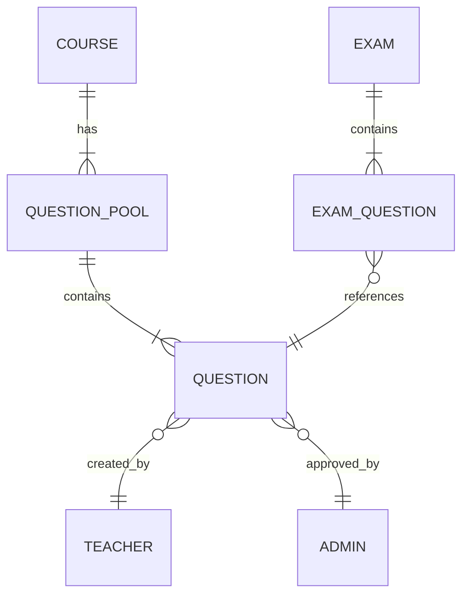

- Questions are categorized by course (e.g., Mathematics, English, Science)
- Only approved questions appear in the pool
- Teachers can only use questions from pools they have access to
- Admins can view and manage all question pools

### Time-Based Exam Visibility

Students can only see and take exams when:
1. Exam status is `approved`
2. Current time is >= `availableAt` (exam start time)
3. Current time is <= `endsAt` (exam end time)

```typescript
interface ExamSchedule {
  availableAt: string;  // ISO datetime - exam becomes visible
  endsAt: string;       // ISO datetime - exam closes
  duration: number;     // Duration in minutes once started
}
```

### Exam Taking Flow

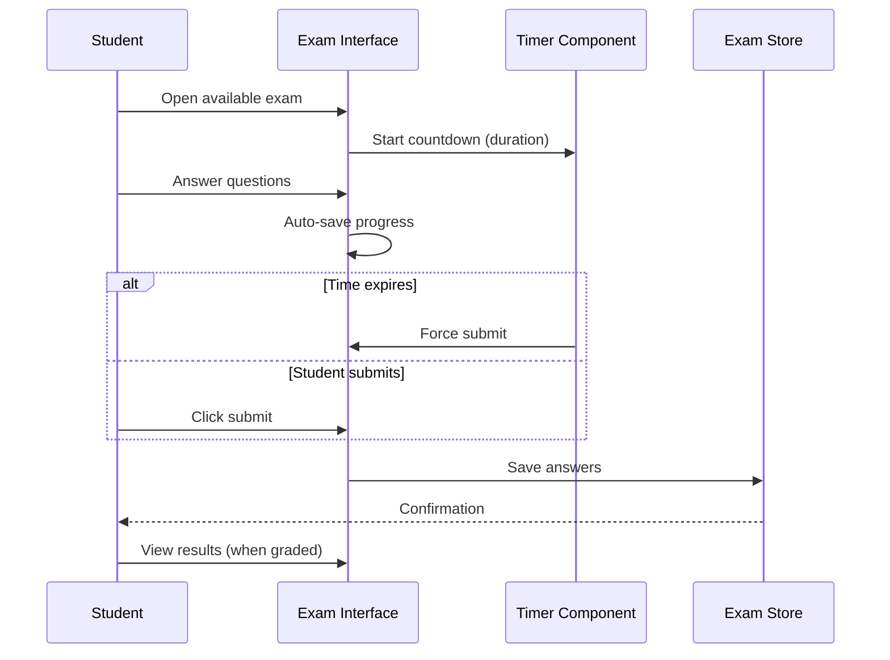

### Grading Workflow

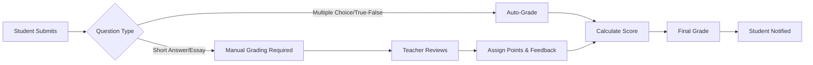

### Data Structures

#### Question Interface
```typescript
interface Question {
  id: string;
  type: 'multiple_choice' | 'true_false' | 'short_answer' | 'essay';
  question: string;
  options?: string[];           // For multiple choice
  correctAnswer?: string | number;
  points: number;
  course: string;

  // Approval workflow
  approvalStatus: 'pending' | 'approved' | 'rejected';
  submittedForApprovalAt?: string;
  approvedBy?: string;
  approvedAt?: string;
  rejectionReason?: string;
  createdBy: string;
}
```

#### Exam Interface
```typescript
interface Exam {
  id: string;
  title: string;
  course: string;
  grade: string;
  questions: Question[];
  totalPoints: number;
  duration: number;             // Minutes
  availableAt: string;          // When students can start
  endsAt: string;               // When exam closes

  // Approval workflow
  approvalStatus: 'draft' | 'pending_approval' | 'approved' | 'rejected';
  submittedForApprovalAt?: string;
  approvedBy?: string;
  approvedAt?: string;
  rejectionReason?: string;
  createdBy: string;
  createdAt: string;
}
```

### Portal Responsibilities

#### Teacher Portal (`/teacher/exams`)
- Create new questions with type, content, and point value
- Submit questions for admin approval
- View question approval status
- Create exams by selecting from approved question pool
- Set exam schedule (availableAt, endsAt, duration)
- Submit exams for admin approval
- Grade submitted exams (short answer, essay questions)
- View student submissions and scores

#### School Admin Portal (`/school-admin/exams`)
- **Pending Approvals Tab**: Review and approve/reject questions and exams
- **Question Pools Tab**: Manage course-specific question pools
- **All Exams Tab**: View all exams across all statuses
- Approve questions → adds to course question pool
- Approve exams → makes available to students at scheduled time
- Reject with reason → sends back to teacher for revision

#### Student Portal (`/student/exams`)
- View upcoming exams with countdown
- Take available exams in full-screen mode
- Timer display during exam
- Question navigation sidebar
- Submit exam answers
- View graded results with feedback

### Notification Flow

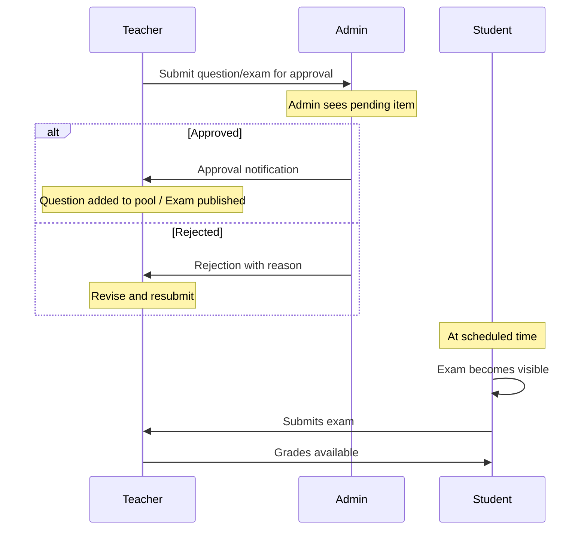

---
*Generated for School Management System (Classivo)*
