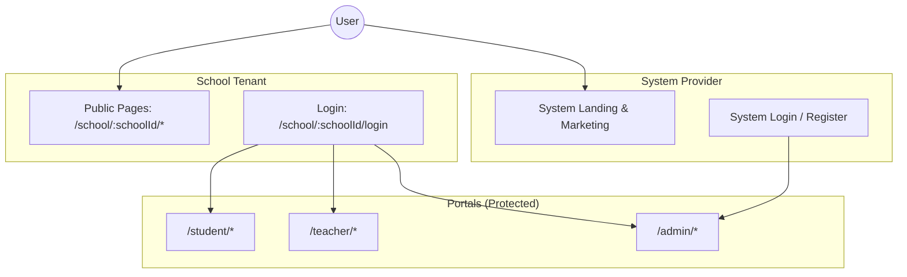
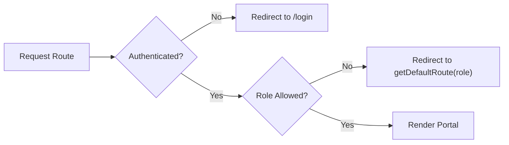
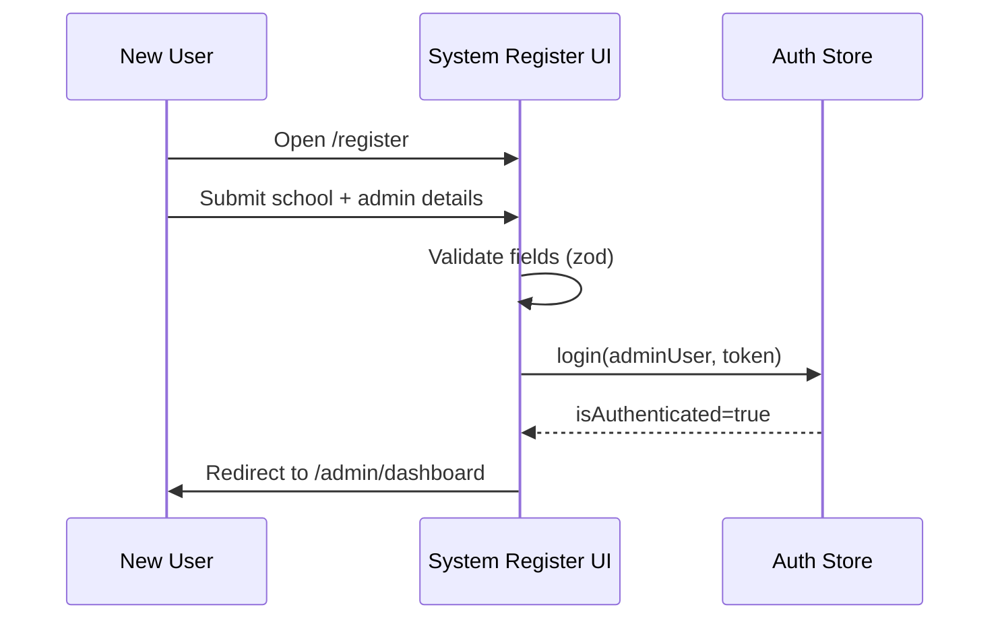
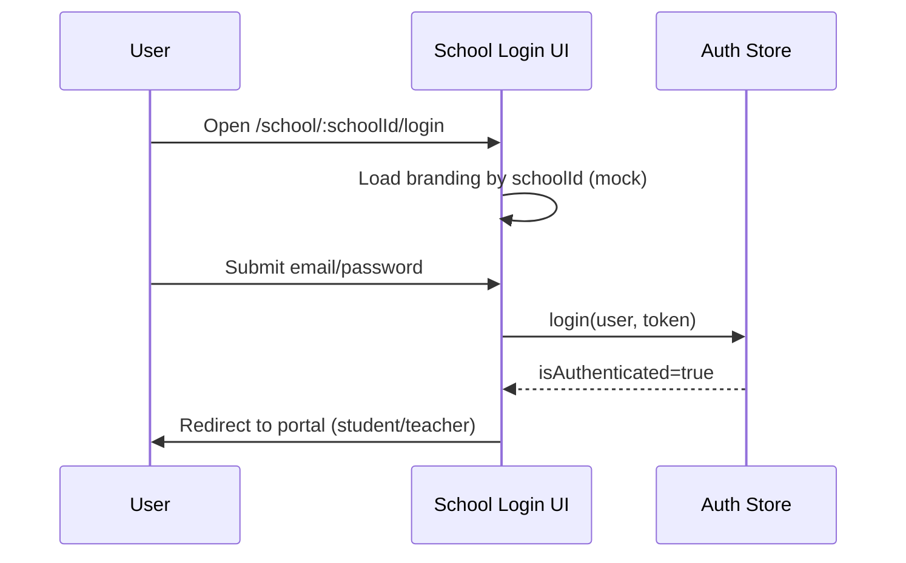
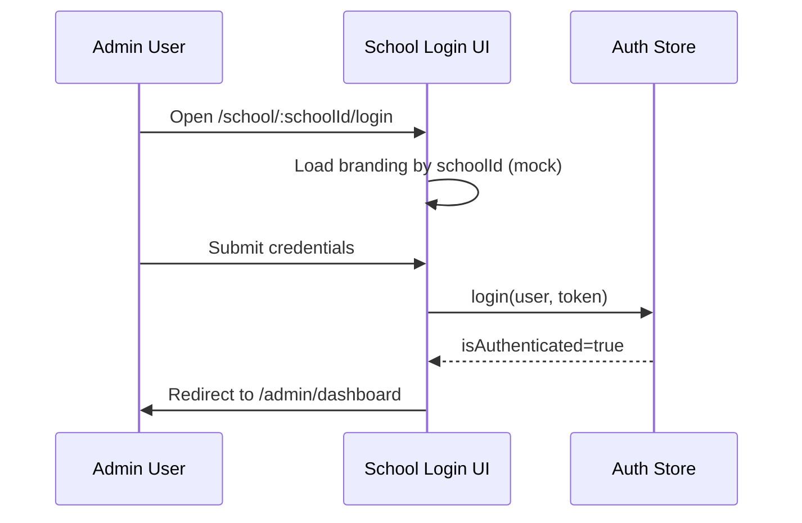
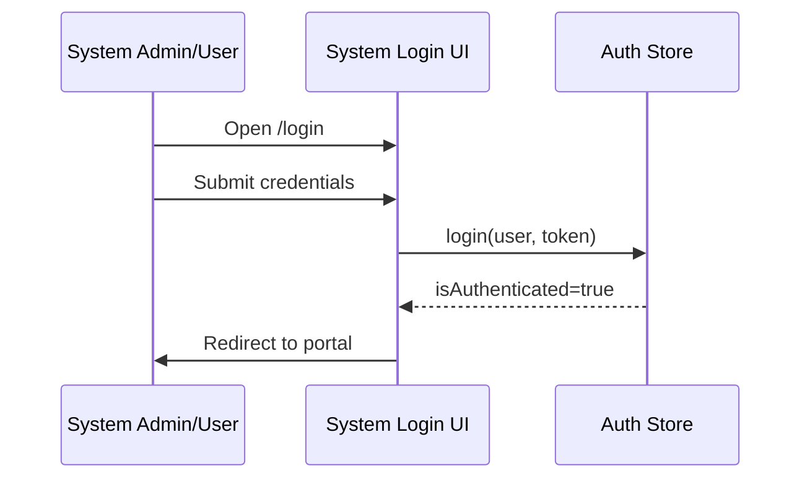
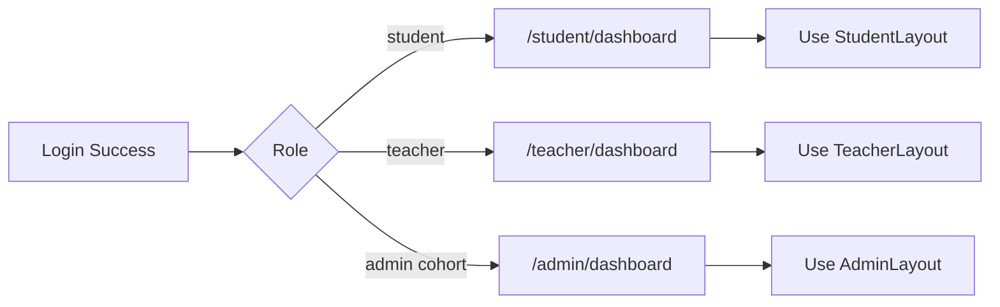
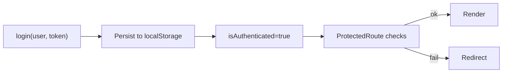
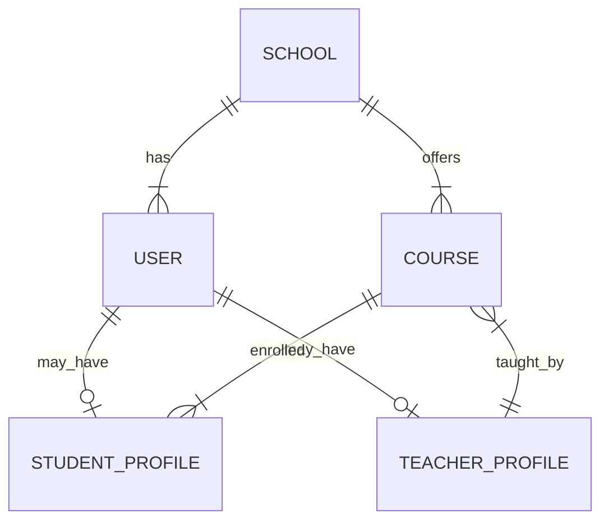

# School Management System — Workflow & Architecture

This document details the multi-tenant architecture, role-based access control, login flows for normal users, school admins, and system admins, data management, and end-to-end portal navigation.

## 1. High-Level Architecture

The application is a single multi-tenant frontend serving multiple schools.

- System Provider (Platform Owner): Onboards schools and manages global pages.
- Tenants (Schools): Each school has public pages and branded login under `school/:schoolId`.
- Portals: Role-specific portals are protected routes.

## 2. Roles & Access Control

RBAC is enforced client-side by a route guard.

- Roles: `director`, `administrator`, `manager`, `finance_officer`, `help_desk`, `teacher`, `student` (`src/types/auth.ts:13`).
- Guard: `ProtectedRoute` checks auth and allowed roles (`src/components/shared/ProtectedRoute.tsx:11`).
- Mapping: `getDefaultRoute(role)` returns portal home (`src/config/routes.ts:46`).
- Permissions: `ROUTE_PERMISSIONS` defines allowed roles per path (`src/config/routes.ts:9`).

## 3. System Signup (First School Admin)

- Entry: `GET /register` (`src/pages/system/auth/Register.tsx:21`).
- Purpose: Create the first school administrator during initial signup.
- Validate: `school`, `name`, `email`, `password` with `zod`.
- Create: Initialize School entity and the first Admin user (mocked client-side currently).
- Session: Persist via `useAuthStore.login(user, token)`.
- Redirect: `getDefaultRoute('administrator')` → `/admin/dashboard` (`src/config/routes.ts:46`).

## 4. Login Entry Points

### A. Normal Users (Students, Teachers)
- Entry: `GET /school/:schoolId/login` (`src/pages/school-public/auth/SchoolLogin.tsx:18`).
- Load: Fetch school branding by `schoolId` (mocked) and render login.
- Validate: Form validated with `zod` (`loginSchema`).
- Authenticate: Demo-only, maps email to role.
- Session: `useAuthStore.login(user, token)` persists to localStorage (`src/stores/authStore.ts:22`).
- Redirect: Compute default portal route and navigate.

### B. School Admins (Director, Administrator, Manager, Finance Officer, Help Desk)
- Entry: `GET /school/:schoolId/login` (same branded login).
- Authenticate: Demo-only; role maps to admin cohort.
- Session: Persist via `useAuthStore`.
- Redirect: Admin default dashboard.

### C. System Admins (Platform-Level)
- Entry: `GET /login` (`src/pages/system/auth/Login.tsx:15`).
- Use: Intended for platform owner or cross-tenant login.
- Authenticate: Demo-only; sets role based on email.
- Session: Persist via `useAuthStore`.
- Redirect: `getDefaultRoute(role)` → admin/student/teacher portal.

## 5. Routing Strategy & Portals

Public routes (`src/App.tsx:65-74`): `/`, `/about`, `/contact`, `/pricing`, `/terms`, `/privacy`, `/login`, `/register`, `/forgot-password`.

School public routes (`src/App.tsx:77-82`): `/school/:schoolId`, `/school/:schoolId/about`, `/school/:schoolId/contact`, `/school/:schoolId/pricing`, `/school/:schoolId/rules`, `/school/:schoolId/login`.

Protected portals (`src/App.tsx:84-139`):
- Student: `/student/*` → `dashboard`, `courses`, `exams`, `profile`, `fees`.
- Teacher: `/teacher/*` → `dashboard`, `courses`, `students`, `exams`, `announcements`.
- Admin: `/admin/*` → `dashboard`, `courses`, `finance`, `reports`, `settings`, `students`, `teachers`, `announcements`, `exams`, `invoices`.

Note: Portal routes are currently global (not prefixed by `:schoolId`). If tenant-scoped portals are desired (e.g., `/:schoolId/admin/*`), update the router definitions accordingly (`src/App.tsx:84-139`).

## 6. Security & Session Management

- Store: Zustand with `persist` saves `user`, `token`, `isAuthenticated` in `localStorage` under `auth-storage` (`src/stores/authStore.ts:67`).
- Token: Demo-only opaque `token` string; no JWT decode/refresh.
- Guard: `ProtectedRoute` enforces auth and roles; redirects unauthenticated to `/login` and unauthorized to `getDefaultRoute(role)` (`src/components/shared/ProtectedRoute.tsx:22-29`).
- Future (recommended): Use HTTP-only cookies for JWT, add refresh rotation, and server-side validation.

## 7. Data Handling & Models

Conceptual multi-tenant data ownership:

- School: Root tenant entity.
- User: `id`, `email`, `role`, `firstName`, `lastName`, `isActive`, timestamps (`src/types/auth.ts:1-20`).
- Academic & Finance: exams, announcements, invoices, etc. in `src/types/*`.

Relationships (conceptual):

## 8. End-to-End Workflows

### Login to Portal
1. User opens login (system or school).
2. UI validates input; authenticates (demo).
3. Store persists session and token.
4. Compute default route via role.
5. Navigate to portal; `ProtectedRoute` verifies on each portal page.

### Unauthorized Access
- Unauthenticated → redirect to `/login`.
- Authenticated but wrong role → redirect to role default.

### Invalid School Id (School Login)
- If `schoolId` is invalid, show error page on `/school/:schoolId/*`.

## 9. Multi-Tenancy Notes

- Public school context is maintained via `:schoolId` in URLs.
- Portals are global by default. If cross-tenant separation is needed for portals, add `:schoolId` prefix and propagate context through layouts and API calls.

---
Generated for School Management System
